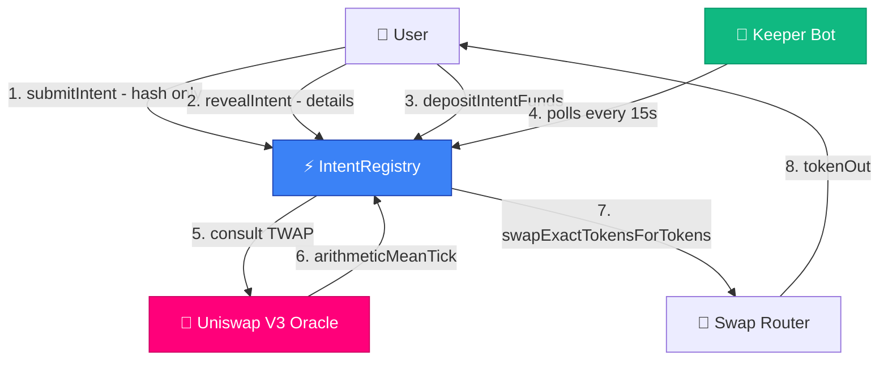
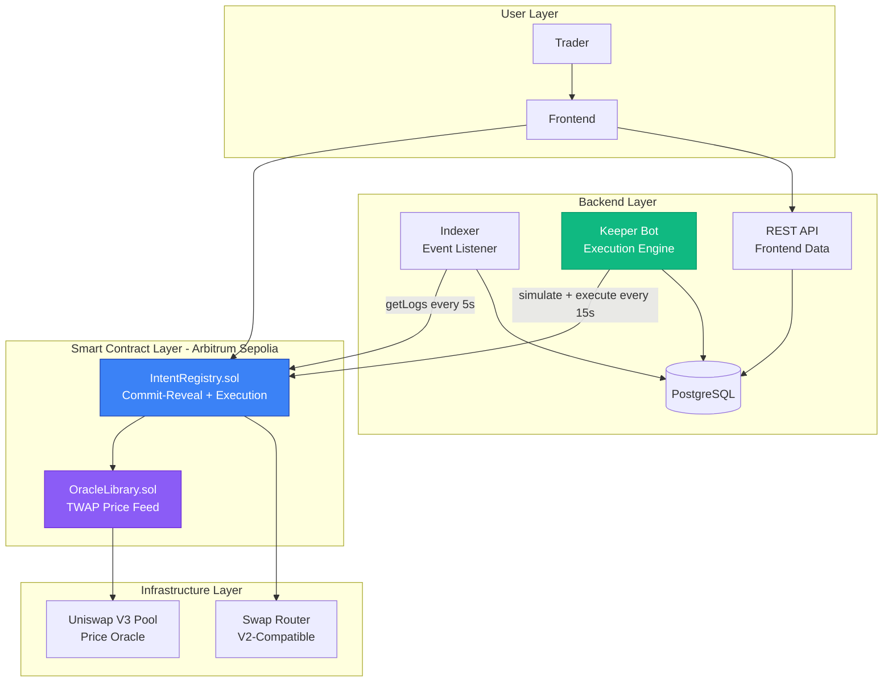
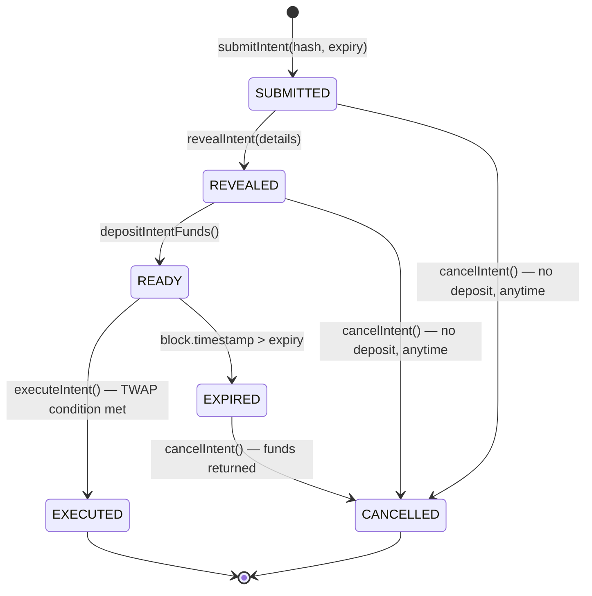
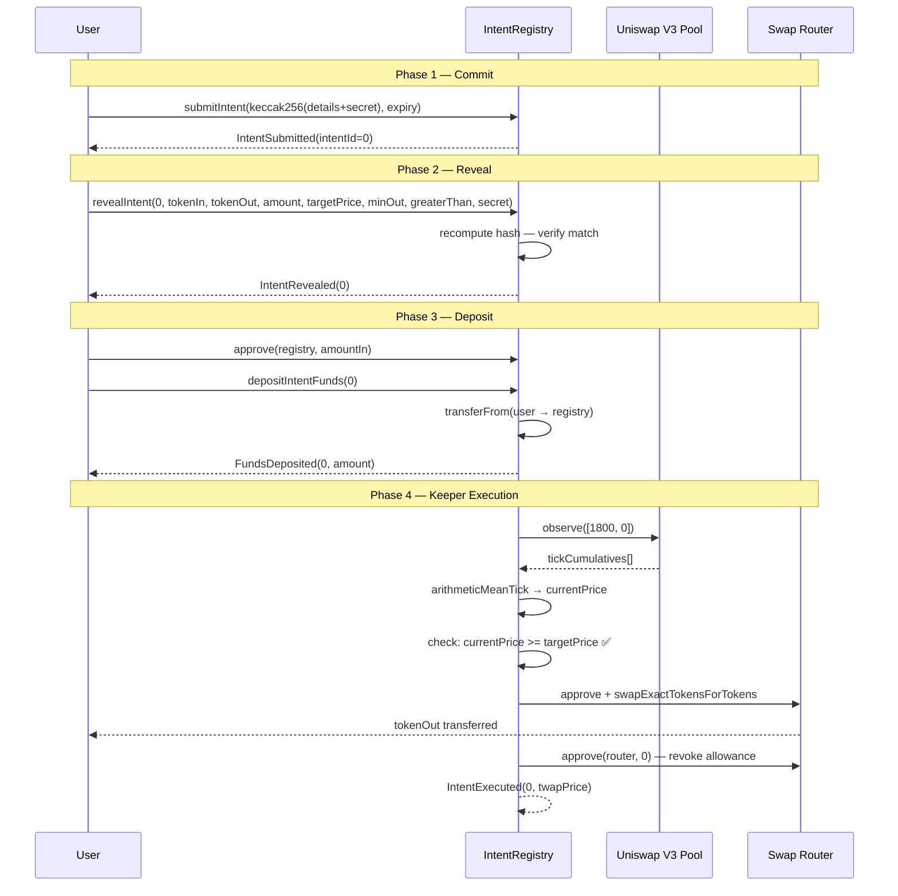

# Veil Swap

**MEV-Resistant Intent-Based Trading Protocol on Arbitrum**

`Veil Swap` is a decentralized limit order protocol that uses a commit-reveal scheme and Uniswap V3 TWAP oracles to let users place private, manipulation-resistant trade intents — executed by keepers only when real on-chain price conditions are met.

**Deployed Status:** 🚧 Deployed on Arbitrum Sepolia Testnet  
**Solidity:** `^0.8.20` — Foundry project  
**Test Coverage:** Unit · Fuzz · Invariant (Foundry)  
**Audit Status:** Pre-audit  
**Hackathon:** [Arbitrum Open House London — Online Buildathon](https://www.hackquest.io/hackathons/Arbitrum-Open-House-London-Online-Buildathon)

---

## Executive Summary

**What:** A decentralized limit order protocol where trade details stay hidden until execution conditions are met.  
**Why:** On-chain limit orders are front-runnable. Submitting your price target and token amounts in plaintext invites MEV bots to sandwich or frontrun your trade before it executes.  
**How:** Commit-reveal scheme + Uniswap V3 TWAP oracle + keeper network. You commit a hash of your intent, reveal only when ready, and a keeper executes when the 30-minute TWAP confirms the price condition — with slippage protection baked into the commitment so it can't be modified post-submission.

---

## The Problem

Standard on-chain limit orders expose everything:

```
submitOrder(tokenIn, tokenOut, amount, targetPrice)  ← all visible in mempool
```

MEV bots see this, watch the price approach your target, and frontrun your execution — buying before you, pushing the price past your target, and selling into your trade. You execute at a worse price, they profit.

---

## The Solution: Commit → Reveal → Execute

```
submitIntent(keccak256(details + secret), expiry)   ← only hash visible
        ↓
revealIntent(all details)                            ← details now on-chain
        ↓
depositIntentFunds()                                 ← tokens locked in registry
        ↓
[keeper monitors TWAP every 15 seconds]
        ↓
executeIntent()  ← fires only when TWAP condition is met
```

The hash commits you to every parameter — including `minAmountOut` (slippage protection) — before any details are visible. A frontrunner watching the mempool sees only a hash. By the time details are revealed, the 30-minute TWAP window makes single-block price manipulation economically irrational.

---

## Protocol Flow



---

## System Architecture



---

## Intent Lifecycle



---

## Complete Execution Sequence



---

## Smart Contracts

| Contract           | Address (Arbitrum Sepolia)                   | Purpose                                       | Status      |
| ------------------ | -------------------------------------------- | --------------------------------------------- | ----------- |
| IntentRegistry     | `0x28d9962792169f9dEC7FA9fcd0Ef348954553f06` | Commit-reveal, execution gating, fund custody | ✅ Deployed |
| MockERC20 (TokenA) | `0x121872eFfbcEDdD41d1E9Ae25Dcf16dc0C8b6650` | Demo token for testnet                        | ✅ Deployed |
| MockERC20 (TokenB) | `0xB8101132fa8a75d996476327EF56F5e5d7be40A0` | Demo token for testnet                        | ✅ Deployed |

**Network:** Arbitrum Sepolia Testnet  
**Chain ID:** `421614`  
**RPC:** `https://sepolia-rollup.arbitrum.io/rpc`  
**Explorer:** `https://sepolia.arbiscan.io`  
**Uniswap V3 Factory:** `0x248AB79Bbb9bC29bB72f7Cd42F17e054Fc40188e`  
**Swap Router:** `0x101F443B4d1b059569D643917553c771E1b9663E`

---

## IntentRegistry.sol

**Purpose:** The core protocol contract. Manages the full lifecycle of trade intents: commitment, reveal, deposit, TWAP-gated execution, and cancellation.

### Key Security Properties

| Property               | Mechanism                                                                                 |
| ---------------------- | ----------------------------------------------------------------------------------------- |
| MEV resistance         | Details hidden in hash until reveal; 30-min TWAP makes block-level manipulation costly    |
| Slippage protection    | `minAmountOut` committed inside the hash — cannot be changed post-submission              |
| No expiry substitution | Expiry is stored at submit time and pulled from storage at reveal — not a caller argument |
| CEI pattern            | `intent.executed = true` set before any external calls                                    |
| Allowance hygiene      | Router approval revoked to 0 immediately after every swap                                 |
| Keeper-permissionless  | Anyone can call `executeIntent` — no trusted keeper required                              |

### State Variables

| Variable         | Type                                            | Description                          |
| ---------------- | ----------------------------------------------- | ------------------------------------ |
| `ROUTER`         | `IRouter immutable`                             | Uniswap-compatible swap router       |
| `CONTRACT_OWNER` | `address immutable`                             | Deployer — can only register pools   |
| `TWAP_INTERVAL`  | `uint32 = 1800`                                 | 30-minute TWAP window                |
| `nextIntentId`   | `uint256`                                       | Auto-incrementing intent counter     |
| `tokenPairPool`  | `mapping(address ⇒ mapping(address ⇒ address))` | Registered Uniswap V3 pools per pair |
| `intents`        | `mapping(uint256 ⇒ TradeIntent)`                | All intent state                     |

### TradeIntent Struct

| Field            | Type      | Set At  | Description                                                          |
| ---------------- | --------- | ------- | -------------------------------------------------------------------- |
| `user`           | `address` | Submit  | Intent owner                                                         |
| `tokenIn`        | `address` | Reveal  | Token being sold                                                     |
| `tokenOut`       | `address` | Reveal  | Token being bought                                                   |
| `amountIn`       | `uint256` | Reveal  | Amount to sell                                                       |
| `targetPrice`    | `uint256` | Reveal  | Price threshold                                                      |
| `minAmountOut`   | `uint256` | Reveal  | Slippage floor — committed in hash                                   |
| `greaterThan`    | `bool`    | Reveal  | `true` = sell when price ≥ target; `false` = buy when price ≤ target |
| `expiry`         | `uint256` | Submit  | Deadline timestamp                                                   |
| `commitmentHash` | `bytes32` | Submit  | `keccak256(all fields + secret)`                                     |
| `revealed`       | `bool`    | Reveal  | Phase flag                                                           |
| `deposited`      | `bool`    | Deposit | Fund custody flag                                                    |
| `executed`       | `bool`    | Execute | Terminal success flag                                                |
| `cancelled`      | `bool`    | Cancel  | Terminal cancel flag                                                 |

### Core Functions

**`submitIntent(bytes32 commitmentHash, uint256 expiry)`**  
Stores the hash commitment. No trade details visible. Reverts if expiry is not strictly in the future.

**`revealIntent(uint256 intentId, address tokenIn, address tokenOut, uint256 amountIn, uint256 targetPrice, uint256 minAmountOut, bool greaterThan, bytes32 secret)`**  
Recomputes the hash from caller-supplied plaintext + stored expiry. Reverts on any mismatch. Only the intent owner can reveal.

**`depositIntentFunds(uint256 id)`**  
Pulls `amountIn` of `tokenIn` from the user into the registry via `transferFrom`. Requires prior ERC-20 approval.

**`executeIntent(uint256 intentId)`**  
Fetches TWAP price from the registered Uniswap V3 pool, checks the price condition, and executes the swap via the router. Callable by anyone (keeper pattern).

**`cancelIntent(uint256 intentId)`**  
Owner-only. If deposited, refunds `amountIn` after expiry. If not deposited, cancellable at any time.

**`registerPool(address tokenA, address tokenB, address pool)`**  
Owner-only. Registers a Uniswap V3 pool as the TWAP oracle for a token pair.

### Commitment Hash Construction

```solidity
bytes32 commitmentHash = keccak256(abi.encodePacked(
    msg.sender,   // user
    tokenIn,
    tokenOut,
    amountIn,
    targetPrice,
    minAmountOut, // ← slippage bound is part of the commitment
    greaterThan,
    expiry,       // ← pulled from storage, not caller arg — prevents substitution attacks
    secret
));
```

---

## TWAP Oracle

The price gate in `executeIntent` uses Uniswap V3's time-weighted average price (TWAP) over a 30-minute window:

```solidity
uint32 public constant TWAP_INTERVAL = 1800; // 30 minutes

(int24 arithmeticMeanTick,) = OracleLibrary.consult(pool, TWAP_INTERVAL);
uint256 currentPrice = OracleLibrary.getQuoteAtTick(
    arithmeticMeanTick,
    uint128(intent.amountIn),
    intent.tokenIn,
    intent.tokenOut
);
```

**Why TWAP and not spot price?**  
Spot price can be moved in a single transaction. To manipulate a 30-minute TWAP, an attacker must hold the price off-market for 30 continuous minutes while arbitrageurs drain their position. The cost scales with the pool's liquidity depth and the size of the deviation — making manipulation economically irrational for any well-liquidity pool.

---

## Backend

The backend is a Node.js/TypeScript service with three co-located components:

### Indexer

Polls the chain every 5 seconds using `getLogs` in 2000-block chunks. Processes all contract events in block/log-index order and writes to PostgreSQL. Resumes from `lastIndexedBlock` on restart — no replaying from genesis.

Events indexed: `IntentSubmitted`, `IntentRevealed`, `FundsDeposited`, `IntentExecuted`, `IntentCancelled`

### Keeper Bot

Polls PostgreSQL every 15 seconds for `READY` intents (revealed + deposited + not expired). For each candidate, calls `simulateContract` first — the contract reverts with `PriceConditionNotMet` if the TWAP isn't there yet, costing no gas. Only when simulation passes does it send the real transaction. Includes a configurable gas price cap to prevent execution during gas spikes.

### REST API

| Method | Endpoint                         | Description                                              |
| ------ | -------------------------------- | -------------------------------------------------------- |
| `GET`  | `/api/v1/health`                 | Liveness probe                                           |
| `GET`  | `/api/v1/stats`                  | Aggregate counts by status                               |
| `GET`  | `/api/v1/intents`                | List intents — filterable by `user`, `status`, paginated |
| `GET`  | `/api/v1/intents/:intentId`      | Single intent by ID                                      |
| `GET`  | `/api/v1/users/:address/intents` | All intents for a wallet                                 |

**Stack:** Node.js · TypeScript · Express · Prisma · PostgreSQL · viem

---

## Frontend

> 🖼️ **[PLACEHOLDER — Frontend screenshots will be added here]**

**Stack:** `[PLACEHOLDER — e.g. Next.js · TypeScript · Tailwind · wagmi · RainbowKit]`  
**Live App:** `[PLACEHOLDER — deployment URL]`

---

## Project Structure

```
├── src/
│   ├── IntentRegistry.sol         ← core protocol contract
│   ├── interfaces/
│   │   ├── IERC20.sol
│   │   └── IRouter.sol
│   └── libraries/
│       └── OracleLibrary.sol      ← Uniswap V3 TWAP library (pragma patched for 0.8.x)
├── script/
│   ├── DeployAll.s.sol            ← deploys registry + mock tokens + creates V3 pool
│   └── DeployIntentRegistry.s.sol
├── test/
│   ├── unit/
│   │   ├── CoverageGapTest.t.sol      ← tests added to cover previously uncovered lines/branches
│   │   ├── DeployAllTest.t.sol
│   │   ├── DeployIntentRegistryTest.t.sol
│   │   ├── IntentRegistryBase.sol
│   │   ├── IntentRegistryBranchesTest.t.sol
│   │   ├── IntentRegistryTest.t.sol
│   │   ├── Mocks.sol              ← MockERC20, MockRouter, HarnessIntentRegistry
│   │   ├── MockUniswapV3PoolTest.t.sol
│   │   ├── OracleBranchesTest.t.sol
│   │   └── OracleLibraryTest.t.sol
│   ├── fuzz/
│   │   └── IntentRegistryFuzzTest.t.sol
│   └── invariant/
│       ├── IntentRegistryHandler.sol
│       └── IntentRegistryInvariantTest.t.sol
├── backend/
│   ├── src/
│   │   ├── index.ts               ← entry point
│   │   ├── indexer/indexer.ts
│   │   ├── keeper/keeper.ts
│   │   ├── api/
│   │   │    ├── app.ts
│   │   │    └── routes.ts
│   │   ├── db/client.ts
│   │   ├── utils/
│   │   │    ├── client.ts
│   │   │    └── logger.ts
│   │   └── types/index.ts
│   └── prisma/schema.prisma
├── frontend/                      ← [PLACEHOLDER]
├── foundry.toml
└── README.md
```

---

## Quick Start

### Prerequisites

- [Foundry](https://getfoundry.sh) — `curl -L https://foundry.paradigm.xyz | bash`
- Node.js 20+
- PostgreSQL (or Docker)
- An Arbitrum Sepolia RPC URL (free from [Alchemy](https://alchemy.com) or [Infura](https://infura.io))

### Clone

```bash
git clone https://github.com/[PLACEHOLDER_GITHUB_USERNAME]/[PROJECT_NAME].git
cd [PROJECT_NAME]
```

### Smart Contracts

```bash
# Install Foundry dependencies
forge install

# Build
forge build

# Run all tests
forge test

# Run with coverage
forge coverage --ir-minimum

# Run specific test suites
forge test --match-contract IntentRegistryUnitTest -v
forge test --match-contract IntentRegistryFuzzTest -v
forge test --match-contract IntentRegistryInvariantTest -v
```

### Deploy to Arbitrum Sepolia

```bash
# Set environment variables
cp .env.example .env
# Fill in PRIVATE_KEY and ARBISCAN_API_KEY in .env
source .env

# Deploy everything (registry + mock tokens + Uniswap V3 pool)
forge script script/DeployAll.s.sol:DeployAll \
  --rpc-url https://sepolia-rollup.arbitrum.io/rpc \
  --private-key $PRIVATE_KEY \
  --broadcast \
  --verify \
  --verifier-url https://api-sepolia.arbiscan.io/api \
  --etherscan-api-key $ARBISCAN_API_KEY \
  -vvvv

# ⚠️ After deploying: add liquidity to the Uniswap V3 pool
# and wait 30 minutes before calling executeIntent
# The TWAP oracle needs 1800 seconds of observation history
```

### Backend

```bash
cd backend

# Install dependencies
npm install

# Configure environment
cp .env.example .env
# Fill in: RPC_URL, INTENT_REGISTRY_ADDRESS, KEEPER_PRIVATE_KEY, DATABASE_URL

# Set up PostgreSQL (Docker)
docker run --name intent-db \
  -e POSTGRES_USER=postgres \
  -e POSTGRES_PASSWORD=postgres \
  -e POSTGRES_DB=intent_registry \
  -p 5432:5432 -d postgres:16

# Run database migrations
npx prisma migrate dev --name init

# Start (indexer + keeper + API all in one process)
npm run dev
```

API will be available at `http://localhost:3001`.

---

## Testing

The full test suite is written in Foundry and covers **202 tests** across unit, fuzz, invariant, branch-coverage, and mock validation categories.

```bash
# Run all tests
forge test

# Run with coverage (--ir-minimum resolves stack-too-deep on coverage builds)
forge coverage --ir-minimum

# Run a specific suite
forge test --match-contract IntentRegistryUnitTest -v
forge test --match-contract IntentRegistryFuzzTest -v
forge test --match-contract IntentRegistryInvariantTest -v
```

---

### Test Architecture

All tests use Foundry. The `HarnessIntentRegistry` subclass in `test/unit/Mocks.sol` exposes `executeIntentWithMockPrice(intentId, mockPrice)`, which replaces the two `OracleLibrary` calls with a caller-supplied price. This lets every unit, fuzz, and invariant test exercise the full execution logic — guards, CEI ordering, approve/revoke, event emission — without a live Uniswap V3 pool. The real `executeIntent` path (with actual TWAP oracle) is covered by `OracleLibraryTest.t.sol` and `OracleBranchesTest.t.sol` via the `OracleLibraryWrapper` contract.

---

### File Overview

| File                                | Category                | Tests | What it covers                                                                                               |
| ----------------------------------- | ----------------------- | ----- | ------------------------------------------------------------------------------------------------------------ |
| `IntentRegistryTest.t.sol`          | Unit                    | 53    | Full lifecycle of `IntentRegistry`                                                                           |
| `IntentRegistryBranchesTest.t.sol`  | Branch                  | 6     | Structurally hard-to-reach branches                                                                          |
| `IntentRegistryFuzzTest.t.sol`      | Fuzz                    | 14    | Property-based invariants on inputs                                                                          |
| `IntentRegistryInvariantTest.t.sol` | Invariant               | 8     | Global state invariants over random action sequences                                                         |
| `OracleLibraryTest.t.sol`           | Unit + Fuzz             | 52    | All 6 OracleLibrary functions across 7 test suites                                                           |
| `OracleBranchesTest.t.sol`          | Branch                  | 13    | Uncovered branches in `getQuoteAtTick`, `getBlockStartingTickAndLiquidity`, `getOldestObservationSecondsAgo` |
| `DeployAllTest.t.sol`               | Unit                    | 42    | All 9 deployment steps + MockERC20 + end-to-end flow                                                         |
| `DeployIntentRegistryTest.t.sol`    | Unit                    | 3     | `DeployIntentRegistry.s.sol` deploy helper                                                                   |
| `CoverageGapTest.t.sol`             | Unit                    | 27    | Coverage gaps in unit tests                                                                                  |
| `MockUniswapV3PoolTest.t.sol`       | Unit + Fuzz + Invariant | 11    | Mock pool correctness and internal state consistency                                                         |

---

### IntentRegistryTest.t.sol — 53 tests

One section per function. Every custom error selector is tested exactly once in its own test.

**`registerPool`** — bidirectional storage, event emission, non-owner revert, pool overwrite.

**`submitIntent`** — correct struct storage, ID increment, `IntentSubmitted` event, expiry-equals-now revert, past-expiry revert.

**`revealIntent`** — all fields updated correctly, `IntentRevealed` event, not-owner revert, already-revealed revert, hash mismatch on wrong secret / wrong `amountIn` / flipped `greaterThan` / tampered `minAmountOut`, stored-expiry-not-caller-controlled (expiry substitution attack).

**`depositIntentFunds`** — token balance delta, `FundsDeposited` event, not-owner revert, double-deposit revert, deposit-before-reveal revert, failed-transfer state rollback.

**`executeIntentWithMockPrice`** — `greaterThan=true` at target/above/below, `greaterThan=false` at target/below/above, not-revealed revert, already-executed revert, expired revert, pool-not-registered revert, correct router parameters, zero allowance after swap, output tokens go to user, anyone-can-call-as-keeper, `IntentExecuted` event, execute-without-deposit revert, intent data preserved after execution.

**`cancelIntent`** — full refund after expiry, no-deposit cancel anytime, `IntentCancelled` event, not-owner revert, deposited-not-yet-expired revert, already-executed revert, double-cancel revert, cancel-at-exact-expiry revert, cancel-one-second-after-expiry succeeds.

**`getIntent`** — zero struct for unknown ID.

**Multi-intent isolation** — two concurrent intents do not bleed state.

---

### IntentRegistryBranchesTest.t.sol — 6 tests

Targets the three branches that are unreachable through normal happy-path and revert-path tests:

**`depositIntentFunds` — `transferFrom` returns `false`** (`FailingERC20` that returns `false` instead of reverting): hits `IntentRegistry__TransferInDepositIntentFailed`. Confirms the `deposited` flag is not persisted after revert.

**`cancelIntent` — `deposited == false` (no-deposit path)**: the `if (intent.deposited)` false branch — no token transfer occurs, only the flag and event. Tested at submit-only and reveal-only stages.

**`cancelIntent` — `transfer` returns `false`**: uses `BypassRegistry.forceDeposited()` to set `deposited=true` without calling `transferFrom`, then cancels post-expiry to hit `IntentRegistry__CancelTransferFailed`.

---

### IntentRegistryFuzzTest.t.sol — 14 tests

Each property uses `bound()` to constrain inputs efficiently.

| Property | What it proves                                                                    |
| -------- | --------------------------------------------------------------------------------- |
| P1       | Any future expiry is accepted; any past/present expiry always reverts             |
| P2       | Tampered `amountIn` always causes `RevealHashMismatch`                            |
| P3       | Tampered `targetPrice` always causes `RevealHashMismatch`                         |
| P4       | Tampered `minAmountOut` always causes `RevealHashMismatch` — slippage is binding  |
| P5       | Wrong secret always causes `RevealHashMismatch`                                   |
| P6       | Flipped `greaterThan` always causes `RevealHashMismatch`                          |
| P7       | `greaterThan=true`: executes iff `price >= target`; reverts otherwise             |
| P8       | `greaterThan=false`: executes iff `price <= target`; reverts otherwise            |
| P9       | Post-expiry execution always reverts regardless of price                          |
| P10      | Registry balance delta equals exactly `amountIn` on deposit                       |
| P11      | Post-expiry cancel refunds exactly `amountIn`                                     |
| P12      | Pre-expiry cancel on deposited intent always reverts                              |
| P13      | Router always receives the committed `minAmountOut` (slippage binding end-to-end) |
| P14      | `getIntent` always returns a valid struct for any submitted intentId              |

---

### IntentRegistryInvariantTest.t.sol — 8 invariants

Uses the Foundry handler pattern. `IntentRegistryHandler` drives the fuzzer with three actions (`submitRevealDeposit`, `executeIntent`, `cancelIntent`) plus `warpTime`, and maintains ghost accounting variables that the invariant assertions verify.

| #   | Invariant                                                                                                   |
| --- | ----------------------------------------------------------------------------------------------------------- |
| I1  | `registry.tokenIn.balance == totalDeposited − totalExecuted − totalRefunded` at all times                   |
| I2  | `executed && cancelled` is never simultaneously true for any intent                                         |
| I3  | `executed` flag is terminal — never resets to false once set                                                |
| I4  | `cancelled` flag is terminal — never resets to false once set                                               |
| I5  | Every revealed intent satisfies its original `commitmentHash`                                               |
| I6  | `nextIntentId` is monotonically non-decreasing                                                              |
| I7  | Router allowance on `tokenIn` is always zero between transactions                                           |
| I8  | `ghost_totalRefunded` exactly matches the sum of `amountIn` across all on-chain cancelled+deposited intents |

---

### OracleLibraryTest.t.sol — 52 tests across 7 suites

Uses `OracleLibraryWrapper` (a thin contract that exposes all `internal` library functions as `external`) and `MockUniswapV3Pool` (a full mock that satisfies both the `observe()` API used by `consult()` and the `slot0()`/`observations()` API used by `getBlockStartingTickAndLiquidity` and `getOldestObservationSecondsAgo`).

**`ConsultTest`** — zero tick, positive tick, positive-with-negative-baseline, negative exact division, negative exact no-extra-round, negative rounds toward −∞, minimum `secondsAgo=1`, harmonic mean liquidity non-zero, larger delta gives lower liquidity. Revert: `secondsAgo=0`.

**`ConsultFuzzTest`** — floor-division rounding holds for all tick deltas and windows; mean tick stays within the valid Uniswap range `[MIN_TICK, MAX_TICK]`.

**`GetQuoteAtTickTest`** — tick 0 returns base amount for both token orderings, positive tick gives higher quote, boundary ticks (MIN/MAX) do not revert, large/zero base amounts, both token ordering branches.

**`GetOldestObservationSecondsAgoTest`** — cardinality-zero revert, single observation wraps to self, next-initialized path, next-uninitialized fallback to index 0. Fuzz: seconds-ago always matches the timestamp delta.

**`GetBlockStartingTickAndLiquidityTest`** — cardinality-one revert, uninitialized-prev revert, past-block returns slot0 tick and pool liquidity directly.

**`GetWeightedArithmeticMeanTickTest`** — single entry, equal weights, unequal weights, negative ticks exact, negative ticks floor rounding, positive ticks truncation, mixed-sign zero result, dominant weight. Fuzz: single entry always returns its tick; symmetric ticks average near zero; result bounded by input range.

**`GetChainedPriceTest`** — length mismatch revert (two variants), single-hop sorted/reversed/negative/zero, two-hop same-order/add-then-subtract. Fuzz: sort order determines sign; round-trip two-hop gives `tick1 − tick2`.

---

### OracleBranchesTest.t.sol — 13 tests across 5 suites

Targets the branches missed by the main oracle suite.

**`GetQuoteAtTickElseBranchTest`** — exercises the `sqrtRatioX96 > type(uint128).max` path (tick ≥ 443637): forward direction gives non-zero output, reversed direction rounds to zero at `1e18` base (mathematically correct — extreme ratio), reversed with `type(uint128).max` base gives non-zero output, threshold comparison confirms IF vs ELSE split at tick 443636/443637.

**`GetQuoteAtTickIfReversedTest`** — IF branch (small sqrt) with `baseToken > quoteToken`: tick 0 reversed is still 1:1, positive tick reversed gives less output, negative tick reversed gives more output.

**`GetOldestObservationInitializedTest`** — next index IS initialized: uses next directly without fallback, confirms it does not fall back to index 0.

**`GetBlockStartingTickCurrentBlockTest`** — latest observation is in the current block: tick derived from cumulative delta (positive), one-second delta, negative cumulative delta, past-block returns slot0 directly. All tests use `vm.warp(10_000)` to prevent `uint32` underflow from Foundry's default `block.timestamp = 1`.

**`MockRouterBranchDocumentationTest`** — documents the structurally unreachable `if (!res)` branch in `MockRouter` (dead code because `MockERC20` always reverts rather than returning `false`).

---

### DeployAllTest.t.sol — 42 tests

Tests every step of the `DeployAll` deployment script via `DeployAllHelper`, a testable equivalent that accepts injected mock addresses for the three Uniswap contracts (`MockUniswapV3Factory`, `MockPositionManager`, `MockUniswapV3Pool`).

**Constants** — 4 tests verifying `FEE`, `SQRT_PRICE_1_TO_1`, tick range, and mint amounts match `DeployAll` exactly.

**`MockERC20` contract** — 8 tests covering every function and revert: constructor metadata, `mint` balance/supply/event, `approve` allowance/event, `transfer` happy-path/insufficient-balance, `transferFrom` happy-path/balance-revert/allowance-revert.

**Steps 1–2 (token deployment)** — correct name, symbol, decimals for both `mWETH` and `mUSDC`; distinct addresses.

**Step 3 (registry deployment)** — router address stored correctly, `CONTRACT_OWNER` is deployer, `nextIntentId` starts at zero.

**Step 4 (pool creation) — both branches** — new pool created when none exists; existing pool reused on re-run (idempotent).

**Step 5 (initialization) — both branches** — fresh pool initializes correctly; already-initialized pool does not revert (`try/catch` coverage).

**Step 6 (minting)** — `totalSupply` equals `MINT_AMOUNT_WETH` and `MINT_AMOUNT_USDC`.

**Step 7 (approval)** — position manager has non-zero allowance for both tokens.

**Step 8 (liquidity) — 7 tests** — token ordering matches pool's `token0`/`token1` sort, amounts correct for both `wethIsToken0=true/false`, correct tick range, correct fee, recipient is deployer, zero slippage minimums, future deadline, `mintCalled` flag set.

**Step 9 (pool registration)** — both directions (`weth→usdc` and `usdc→weth`) registered; registry address matches factory.

**End-to-end** — 2 tests running the full `submit → reveal → deposit` flow against the deployed registry to confirm all contracts are wired correctly for real usage.

---

### DeployIntentRegistryTest.t.sol — 3 tests

Tests the `DeployIntentRegistry.s.sol` deploy helper (the script with `vm.prompt` for interactive deployment). Calls `deployer.deploy(ROUTER)` directly, bypassing the `run()` entry point.

- Router address stored correctly in the deployed registry
- Deployed address is non-zero (valid contract)
- `nextIntentId` starts at zero (clean initial state)

---

### MockUniswapV3PoolTest.t.sol — 11 tests across 2 suites

Validates the `MockUniswapV3Pool` contract used throughout the oracle test suite, ensuring the mock itself behaves correctly before it is relied upon as a test dependency.

**`MockUniswapV3PoolTest` (unit + fuzz — 9 tests)** — `setSlot0` stores tick/index/cardinality correctly; `setLiquidity` stores and returns correctly; `pushObservation` stores all four fields; `clearObservations` removes all entries and reverts on subsequent access; `setObserveData` populates both arrays and returns them verbatim from `observe()`. Four matching fuzz tests cover the same functions with arbitrary inputs.

**`MockUniswapV3PoolInvariant` (invariant — 2 invariants)** — `invariant_LiquidityConsistent`: `pool.liquidity()` always equals `pool.liquidityValue()` regardless of action sequence; `invariant_Slot0Consistent`: `slot0()` return values always match the public storage accessors `slot0Tick()`, `observationIndex()`, `observationCardinality()`.

## Integration Guide

### For Traders (Frontend / Direct Contract)

**1. Build the commitment hash (off-chain)**

```javascript
import { keccak256, encodePacked } from "viem";

const secret = keccak256(toHex(crypto.getRandomValues(new Uint8Array(32))));

const commitmentHash = keccak256(
  encodePacked(
    [
      "address",
      "address",
      "address",
      "uint256",
      "uint256",
      "uint256",
      "bool",
      "uint256",
      "bytes32",
    ],
    [
      userAddress,
      tokenIn,
      tokenOut,
      amountIn,
      targetPrice,
      minAmountOut,
      greaterThan,
      expiry,
      secret,
    ],
  ),
);

// Store `secret` securely — you need it to reveal
```

**2. Submit commitment**

```javascript
await registry.write.submitIntent([commitmentHash, expiry]);
```

**3. Reveal intent**

```javascript
await registry.write.revealIntent([
  intentId,
  tokenIn,
  tokenOut,
  amountIn,
  targetPrice,
  minAmountOut,
  greaterThan,
  secret,
]);
```

**4. Deposit funds**

```javascript
// Approve first
await tokenIn.write.approve([registryAddress, amountIn]);
// Then deposit
await registry.write.depositIntentFunds([intentId]);
```

**5. Wait for keeper execution**  
The backend keeper polls every 15 seconds. Once the 30-minute TWAP satisfies your condition, `executeIntent` fires and `tokenOut` lands in your wallet.

### For Keepers (DIY Execution)

Any address can call `executeIntent(intentId)`. The contract does all validation — if the price condition is not met it reverts, costing you only the simulation gas. No trusted role required.

---

## Security Considerations

### Design Decisions

**Why not use Chainlink or Pyth for the price feed?**  
The TWAP oracle is embedded in the Uniswap V3 pool itself — no external dependency, no trusted oracle network. The manipulation cost is entirely a function of the pool's on-chain liquidity depth, making it trustless and permissionless.

**Why does `revealIntent` not accept expiry as an argument?**  
Expiry is pulled from storage (set at submit time), not accepted as a caller argument during reveal. This prevents expiry substitution attacks where someone could extend a commitment's valid window after submission.

**Why is `minAmountOut` part of the commitment hash?**  
If slippage protection could be modified after reveal, a frontrunner could watch your reveal transaction and change your `minAmountOut` to 0 before execution. Committing it in the hash makes it immutable from the moment of `submitIntent`.

### Known Limitations

**1. Single-owner pool registry**

- ⚠️ Only `CONTRACT_OWNER` can register new token pair pools
- **Mitigation:** Governance / multisig migration planned post-hackathon

**2. No partial fills**

- ⚠️ Intents execute all-or-nothing (`amountIn` in full)
- **Mitigation:** Partial fill support is a planned V2 feature

**3. Keeper centralisation risk**

- ⚠️ If no keeper is running, intents expire without execution
- **Mitigation:** `executeIntent` is permissionless — anyone can run a keeper. The backend keeper is a reference implementation.

**4. TWAP manipulation on low-liquidity pools**

- ⚠️ On pools with very little liquidity the manipulation cost is lower
- **Mitigation:** Only register pools with sufficient liquidity depth. The 30-minute window is a strong deterrent at any meaningful liquidity level.

### Audit Status

**Status:** Pre-audit  
**Planned:** Post-hackathon  
**Scope:** `IntentRegistry.sol` + `OracleLibrary.sol`

---

## Development Roadmap

### Phase 1: MVP ✅ Complete

- ✅ `IntentRegistry.sol` — full commit-reveal-execute lifecycle
- ✅ TWAP oracle integration via Uniswap V3 `OracleLibrary`
- ✅ Unit, fuzz, and invariant test suite (Foundry)
- ✅ Node.js backend — indexer, keeper bot, REST API
- ✅ Arbitrum Sepolia deployment

### Phase 2: UX & Decentralisation (4–6 weeks)

- 🚧 Frontend — wallet connect, intent dashboard, real-time status
- 🚧 Multi-sig pool registry governance
- 🚧 Partial fill support
- 🚧 Keeper incentive mechanism (tip from user)

### Phase 3: Mainnet (8–12 weeks)

- ⏳ Security audit
- ⏳ Arbitrum One mainnet deployment
- ⏳ Integration with major Uniswap V3 pools (WETH/USDC, WETH/ARB, etc.)
- ⏳ Keeper network documentation + open keeper registry

### Phase 4: Ecosystem (12–24 weeks)

- ⏳ Multi-hop paths (more than 2 tokens)
- ⏳ Cross-chain intent support
- ⏳ SDK for frontend integrations
- ⏳ DAO governance for pool registry

---

## Technical Stack

- **Smart Contracts:** Solidity `^0.8.20`, Foundry
- **Oracle:** Uniswap V3 `OracleLibrary` — TWAP via `consult()` + `getQuoteAtTick()`
- **Testing:** Foundry — unit, fuzz (`bound()`), invariant (handler pattern)
- **Backend:** Node.js · TypeScript · Express · Prisma ORM · PostgreSQL · viem
- **Frontend:** `[PLACEHOLDER]`
- **Deployment:** Arbitrum Sepolia — Uniswap V3 factory + real swap router, no mock infrastructure

---

## FAQ

**Q: Why use a commit-reveal scheme instead of just submitting the order encrypted?**  
A: On-chain data is always eventually visible. A commit-reveal scheme is trustless — the contract itself verifies the hash match at reveal time, with no trusted third party needed to decrypt anything.

**Q: Can the keeper steal my funds?**  
A: No. `executeIntent` sends `tokenOut` directly to `intent.user` — the original submitter's wallet. The keeper triggering the function has no ability to redirect the output.

**Q: What happens if my intent expires before the price condition is met?**  
A: Your intent becomes `EXPIRED`. Call `cancelIntent` after expiry to recover your deposited `tokenIn`.

**Q: Why Arbitrum?**  
A: Low gas costs make the multi-step flow (submit → reveal → deposit → execute) economically viable for smaller trade sizes. Uniswap V3 is fully deployed on Arbitrum with deep liquidity, giving the TWAP oracle real manipulation resistance.

**Q: Can I run my own keeper?**  
A: Yes. `executeIntent(intentId)` is callable by any address. The backend keeper in this repo is a reference implementation. In production, keeper incentives (gas rebates or tips) would be added to attract competitive keeper networks.

**Q: How is the target price expressed?**  
A: `targetPrice` is expressed as `getQuoteAtTick(tick, amountIn, tokenIn, tokenOut)` — i.e. how many units of `tokenOut` you expect to receive for your `amountIn` of `tokenIn`. This matches exactly what the contract computes when checking the condition.

---

## Team

- **Khushi Barnwal** — Smart Contract Engineering & Backend
- **Nayab Khan** — Frontend Engineering & Product Experience

---

## Contributing

Contributions are welcome. Please open an issue before submitting a PR for non-trivial changes.

```bash
git clone https://github.com/[PLACEHOLDER_GITHUB_USERNAME]/[PROJECT_NAME].git
cd [PROJECT_NAME]
forge install
forge build
forge test
```

---

## Contact

- **GitHub:** [PLACEHOLDER]
- **Issues:** [PLACEHOLDER — link to issues]

---

## License

MIT License — see [LICENSE](./LICENSE)

---

_Built for the [Arbitrum Open House London — Online Buildathon](https://www.hackquest.io/hackathons/Arbitrum-Open-House-London-Online-Buildathon)_
